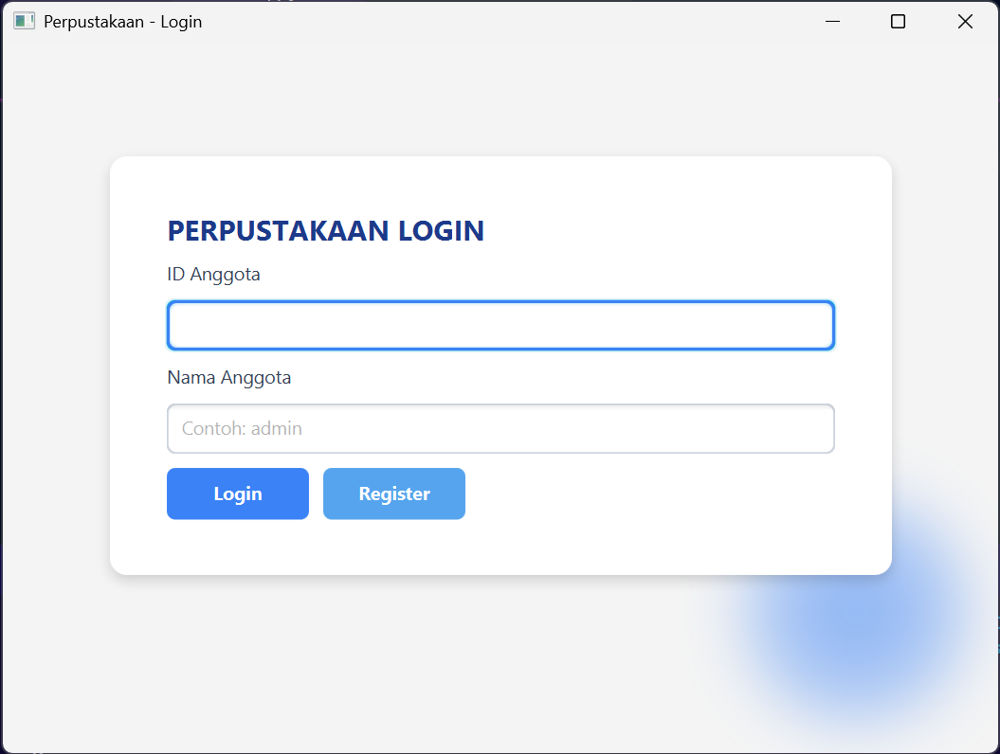
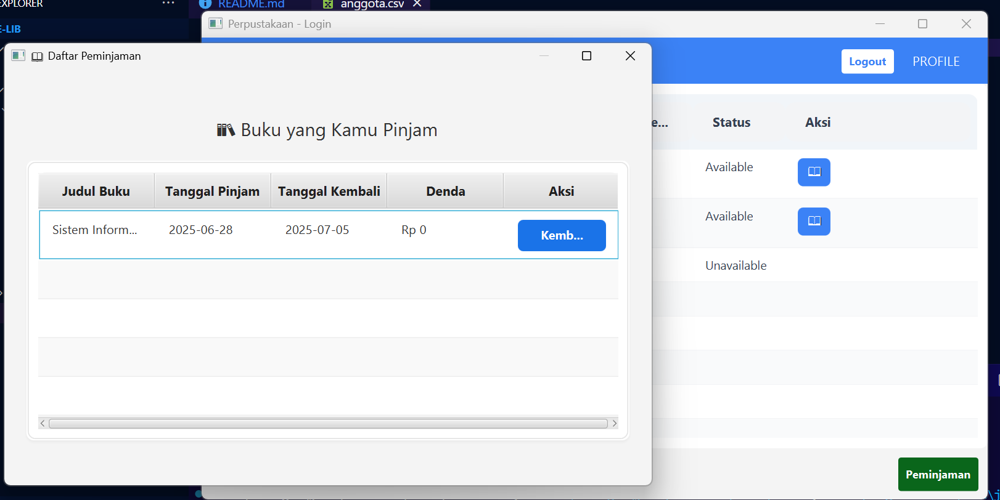

# 📚 E-LIB - Aplikasi Perpustakaan Digital

E-LIB!  
Proyek Ujian Akhir Semester PBO ini adalah aplikasi desktop sederhana berbasis Java + JavaFX untuk mengelola perpustakaan digital.  

---

## Fitur

✅ **Login Anggota**  
✅ **CRUD Data Buku**  
✅ **CRUD Data Anggota**  
✅ **Peminjaman Buku**  
✅ **Pengembalian Buku + Hitung Denda**  
✅ **Pencarian Buku**  
✅ Data disimpan dalam file CSV 

---

## 📸 Screenshot

### Login Page

---

### Halaman Daftar Peminjaman

---
